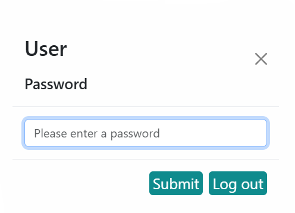
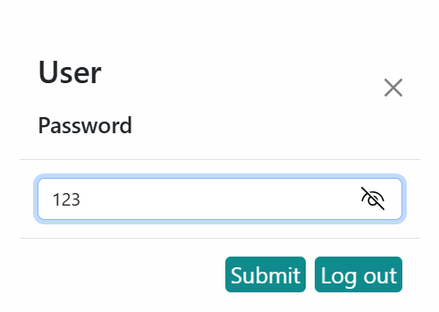
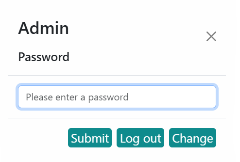

<div><Center><h1><b>WEB PLC IOT</b></h1></Center></div>

## **I. TÌM HIỂU CÁC NGÔN NGỮ DÙNG ĐỂ THIẾT KẾ GIAO DIỆN WEBSITE**
### *1. Cấu tạo HTML*
- `HTML` là viết tắt của cụm từ Hypertext Markup Language (tạm dịch là Ngôn ngữ đánh dấu siêu văn bản). `HTML` được sử dụng để tạo và cấu trúc các thành phần trong trang web hoặc ứng dụng, phân chia các đoạn văn, heading, titles, blockquotes… và `HTML` không phải là ngôn ngữ lập trình.

- Một tài liệu `HTML` được hình thành bởi các phần tử `HTML` (HTML Elements) được quy định bằng các cặp thẻ (tag và attributes). Các cặp thẻ này được bao bọc bởi một dấu ngoặc ngọn (ví dụ `<html>`) và thường là sẽ được khai báo thành một cặp, bao gồm thẻ mở và thẻ đóng. Ví dụ, chúng ta có thể tạo một đoạn văn bằng cách đặt văn bản vào trong cặp tag mở và đóng văn bản `<p>` và `</p>`.

- Mỗi trang `HTML` chứa một bộ các **tag** (cũng được gọi là **elements**). Mỗi thẻ sẽ có những tác dụng nhất định, giúp xây dựng nên một cấu trúc hoàn chỉnh cho Website. Bạn có thể xem như là việc xây dựng từng khối của một trang web. Nó tạo thành cấu trúc cây thư mục bao gồm section, paragraph, heading, và những khối nội dung khác.

- Bố cục `HTML` đơn giản của một trang website:
```html
<!DOCTYPE html>
<html>
<body>
    <title>IoT TEAM</title>
    <h2>IoT TEAM</h2>
</body>
</html>
```
**Trong đó:**
- `<!DOCTYPE html>` : khai báo kiểu dữ liệu hiển thị.

- `<html>` và `</html>` : cặp thẻ bắt buộc, element cấp cao nhất, có nhiệm vụ đóng gói tất cả nội dung của trang HTML.

- `<head>` và `</head>` : khai báo các thông tin meta của trang web như: tiêu đề trang, charset.

- `<title>` và `</title>` : cặp thẻ nằm bên trong thẻ `<head>`, dùng để khai báo tiêu đề của trang.

- `<body>` và `</body>` : cặp thẻ dùng để đóng gói tất cả các nội dung sẽ hiển thị trên trang.

- `<h2></h2>` : định dạng dữ liệu dạng heading. Thông thường có 6 cấp độ heading trong HTML, trải dài từ `<h1>` tới `<h6>`. Trong đó, `<h1>` là cấp độ heading cao nhất và `<h6>` là cấp độ heading thấp nhất.

- `<p>` và `</p>` : cặp thẻ chứa các đoạn văn bản của trang web.
#### ***Ưu điểm của HTML:***
- Được sử dụng rộng rãi, có rất nhiều nguồn tài nguyên hỗ trợ và cộng đồng sử dụng lớn.

- Học đơn giản và dễ hiểu.

- Mã nguồn mở và hoàn toàn miễn phí.

- Markup gọn gàng và đồng nhất.

- Tiêu chuẩn thế giới được vận hành bởi World Wide Web Consortium (W3C).

- Dễ dàng tích hợp với các ngôn ngữ backend như PHP, Python…
#### ***Khuyết điểm của HTML:***
- Được dùng chủ yếu cho web tĩnh. Đối với các tính năng động như update hay realtime thời gian thực, bạn cần sử dụng JavaScript hoặc ngôn ngữ backend bên thứ 3 như PHP.

- Một số trình duyệt chậm hỗ trợ tính năng mới.
### *2. Cấu tạo CSS*
- `CSS` là chữ viết tắt của Cascading Style Sheets, nó là một ngôn ngữ được sử dụng để tìm và định dạng lại các phần tử được tạo ra bởi các ngôn ngữ đánh dấu (`HTML`). Nói ngắn gọn hơn là ngôn ngữ tạo phong cách cho trang web. Bạn có thể hiểu đơn giản rằng, nếu `HTML` đóng vai trò định dạng các phần tử trên website như việc tạo ra các đoạn văn bản, các tiêu đề, bảng,…thì `CSS` sẽ giúp chúng ta có thể thêm style vào các phần tử `HTML` đó như đổi bố cục, màu sắc trang, đổi màu chữ, font chữ, thay đổi cấu trúc…

- `CSS` được phát triển bởi `W3C (World Wide Web Consortium)` vào năm 1996, vì HTML không được thiết kế để gắn tag để giúp định dạng trang web.

- Phương thức hoạt động của `CSS` là nó sẽ tìm dựa vào các vùng chọn, vùng chọn có thể là tên một thẻ HTML, tên một `ID`, `class` hay nhiều kiểu khác. Sau đó là nó sẽ áp dụng các thuộc tính cần thay đổi lên vùng chọn đó.

- Mối tương quan giữa `HTML` và `CSS` rất mật thiết. `HTML` là ngôn ngữ markup (nền tảng của site) và `CSS` định hình phong cách (tất cả những gì tạo nên giao diện website), chúng là không thể tách rời.

#### ***Bố cục của CSS:***
- `Padding` : Gồm không gian xung quanh nội dung (ví dụ: xung quanh đoạn văn bản).

- `Border` : Là đường liền nằm ngay bên ngoài phần đệm.

- `Margin` : Là khoảng cách xung quanh bên ngoài của phần tử.
```css
body {
    color: red; /* thiết lập màu chữ */
    font-size: 14px; /* thiết lập cỡ chữ */
}

h2 {
    color: black; /* thiết lập màu chữ mới cho các phần tử h2 */
    font-size: 18px; /* thiết lập cỡ chữ mới cho các phần tử h2 */
}

p {
    color: blue; /* thiết lập màu chữ mới cho các phần tử p */
}
```
#### ***Nhúng CSS vào website:***
Để `CSS` có thể thực thi trên website hoặc `HTML Documents` thì phải tiến hành nhúng `CSS` vào website. Nếu không, các định dạng `CSS` sẽ không thực thi trên `HTML`. Có 3 cách nhúng `CSS` vào website:

- Inline CSS – Nhúng trực tiếp vào tài liệu HTML thông qua cặp thẻ `<style>` `</style>`.

- Internal CSS – dùng thẻ `<style>` bên trong thẻ `<head>` của HTML để tạo ra nơi viết mã CSS.

- External CSS – Tạo một tập tin .css riêng và nhúng vào tài liệu HTML thông qua cặp thẻ `<link>`.
```css
Inline CSS

<p style="color: blue;"> IoT Team</p>

Internal CSS

<head>
    <style type = text/css>
        body {background-color: blue;}
        p{color:yellow;}
    </style>
</head>

External CSS

<head>
    <link rel="stylesheet" type="text/css" href="style.css">
</head>
``` 
### *3. Nhúng JavaScript vào website*
`JavaScript` là một ngôn ngữ lập trình thông dịch với khả năng hướng đến đối tượng. Là một trong 3 ngôn ngữ chính trong lập trình web và có mối liên hệ lẫn nhau để xây dựng một website sống động, chuyên nghiệp:

- `HTML` : Hỗ trợ trong việc xây dựng layout, thêm nội dung dễ dàng trên website.

- `CSS` : Hỗ trợ việc định dạng thiết kế, bố cục, style, màu sắc,…
- `JavaScript` : Tạo nên những nội dung “động” trên website. 

Nhiệm vụ của `Javascript` là xử lý những đối tượng `HTML` trên trình duyệt. Nó có thể can thiệp với các hành động như thêm / xóa / sửa các thuộc tính `CSS` và các thẻ `HTML` một cách dễ dàng. Hay nói cách khác, `Javascript` là một ngôn ngữ lập trình trên trình duyệt ở phía client.

***Viết chương trình JavaScript:***

**Bước 1** : Tạo 1 file index.html vào bất cứ vị trí nào ở trên máy tính, miễn là chúng có phần mở rộng `.html`. Sau đó, viết một đoạn mã như sau: 
```html
<html>
    <head>
        <title></title>
    </head>
    <body>
        <input type="button" value="Click"/>
    </body>
</html>
```
**Bước 2** : Bạn có thể viết mã chương trình Javascript khi click chuột vào button với `id=“clickme”`.
```html
<html>
    <head>
        <title></title>
    </head>
    <body>
        <input type="button" id="clickme" value="Click"/>
        <script language="javascript">
            // Lấy element có id="clickme" lưu vào biến button
            var button = document.getElementById("clickme");
            
            //Khi click vào element chứa trong button thì thực hiện một function,
            //bên trong function thông báo lên Hello World!
            button.addEventListener("click", function(){
                alert("Hello World!");
            });
        </script>
    </body>
</html>
```
## **II. WEBSITE PLC IOT**

### ***1. Giới thiệu về website***
Website được thiết kế nhằm mục đích tạo một giao diện cho người dùng có thể thiết lập và theo dõi các thông số của ESP32 và PLC. Với việc website có thể hoạt động được trên các thiết bị có thể kết nối với wifi và  sử dụng website không phân biệt hệ điều hành hay thiết bị. Điều này giải quyết tốt mặc hạn chế của PLC.

### ***2. Giao diện đăng nhập***

Ban đầu khi vào website sẽ mặc định ở tài khoản `User` chỉ được phép theo dõi các thông số được tạo ra sẵn và thay đổi một vài thông số.

Để có thể thao tác nhiều hơn cần đăng nhập vào tài khoản của `Amin` hoặc `Staff`. Để đăng nhập cần ấn vào biểu tượng
<div style="text-align: center;">


</div>
Sau đó màn hình sẽ hiện ra giao diện để đăng nhập

<div style="text-align: center;">


</div>

Với mỗi tài khoản `Admin` và `Staff` sẽ có một `Password` khác nhau. Khi nhập đúng thì website sẽ tự động chuyển sang tài khoản theo `Password` của tài khoản đã nhập.

***Ví dụ***: Tài khoản `Admin` sẽ có `Password` là `123`

- Nhập `Password` vào
<div style="text-align: center;">


</div>

- Sau đó sẽ có một thông báo đăng nhập thành công
<div style="text-align: center;">


</div>

- Tiếp đó khi vào lại biểu tượng đăng nhập sẽ thấy đổi từ `User` thành `Admin`
<div style="text-align: center;">


</div>

Sau khi đăng nhập thành công chúng ta có thể thay đổi `Password` bằng cách nhấn vào nút `Change`. Sau đó sẽ xuất hiện giao diện để nhập `Password` mới.
<div style="text-align: center;">


</div>

### ***3. Giao diện cài đặt WiFi***
Giao diện cài đặt WiFi được dùng để người dùng cài đặt kết nối WiFi cho ESP32. Trên giao diện này chúng ta có thể cài đặt tên, mật khẩu, cài đặt IP tĩnh cho WiFi.

Để vào giao diện cần nhấn vào biểu tượng sau
<div style="text-align: center;">


</div>

Sau đó sẽ xuất hiện giao diện `Setting` 
<div style="text-align: center;">


</div>

Nếu muốn cài đặt IP tĩnh cho WiFi cần `Enable` cho `STATIC IP`
<div style="text-align: center;">


</div>

Sau khi cài đặt xong các thông số cho WiFi, ta ấn nút `Save` thì website sẽ gửi xuống ESP32 để cài đặt.

### ***4. Giao diện cài đặt ModBus***
Giao diện cài đặt ModBus dùng để cài đặt các thông số gửi xuống ESP32 để nó có thể giao tiếp với PLC thông qua giao tiếp Modbus.

Để vào giao diện cài đặt ModBus ta chọn biểu tượng sau 
<div style="text-align: center;">


</div>

Sau đó sẽ xuất hiện giao diện cài đặt ModBus. Tiếp đó sẽ chọn vào `MODBUS TYPE` để chọn chế độ hoạt động của Modbus và cài đặt các thông số tương ứng.
<div style="text-align: center;">


</div>

**Trong đó:**
- `RTU` : chạy ở chế độ RTU. Có thể cài đặt thông số `Baud Rate` , chọn `Serial Port` .
<div style="text-align: center;">


</div>

- `TCP/IP` : chạy ở chế độ TCP/IP. Có thể cài đặt các thông số `Ethernet IP` , `Ethernet Getway` , `Ethernet Subnet` , `Ethernet DNS` , ` TCP Mode` .
<div style="text-align: center;">


</div>

- `RTU & TCP/IP` : chạy cả chế độ `RTU` và chế độ `TCP/IP` cùng một lúc. Có thể cài đặt các thông số như: `Baud Rate` , `Serial Port` , `Ethernet IP` , `Ethernet Getway` , `Ethernet Subnet` , `Ethernet DNS` , ` TCP Mode` .
<div style="text-align: center;">


</div>

Sau khi cài đặt các thông số cho Modbus thì chọn `ADD` để thêm thiết bị hoạt động. 

Sau đó sẽ xuất hiện giao diện chọn chọn chế độ hoạt động của thiết bị đó
<div style="text-align: center;">


</div>

**Trong đó:**
- `RTU` : hoạt động ở chế độ `RTU` . Có thế cài đặt các thông số như `ID` (mỗi thiết bị sẽ có một địa chỉ riêng biệt) , `Start Address` (địa chỉ bắt đầu đọc/ghi), `End Address` (địa chỉ kết thúc đọc/ghi).
<div style="text-align: center;">


</div>

- `TCP/IP` : hoạt động ở chế độ `TCP/IP` . Có thế cài đặt các thông số như `ID` (mỗi thiết bị sẽ có một địa chỉ riêng biệt) , `Start Address` (địa chỉ bắt đầu đọc/ghi), `End Address` (địa chỉ kết thúc đọc/ghi).
<div style="text-align: center;">


</div>

### ***5. Giao diện theo dõi thông số (Table Data)***

Giao diện hiển thị các thông số được lưu trong thanh ghi của PLC thông qua giao tiếp Modbus được ESP32 đọc và gửi lên trên website để thuận tiện cho người dùng theo dõi.

Để mở bảng bảng theo dõi ta chọn biểu tượng sau: 
<div style="text-align: center;">


</div>

Sau đó sẽ xuất hiện một bảng thông số đọc được từ PLC và gửi lên thông qua ESP32 

<div style="text-align: center;">


</div>

**Trong đó:**
- `1`: số thứ tự của bảng

- `2`: địa chỉ IP của thiết bị 

- `3`: địa chỉ thanh ghi đọc từ PLC

- `4`: hiển thị kiểu dữ liệu. Có thể thay đổi kiểu dữ liệu khác như: `WORD` , `CHAR` , `COIL` , `DWORD` , `FLOAT` .

- `5`: dữ liệu đọc được

- `6`: nút chỉnh sửa dữ liệu trực tiếp trên bảng
### ***6. Giao diện cài đặt thẻ theo dõi thông số***
Giao diện dùng để cài đặt các thông số cần theo dõi lên thẻ. Để mở giao diện cần nhấn vào biểu tượng
<div style="text-align: center;">


</div>

Sau đó sẽ xuất hiện giao diện để có thể chọn các thông số cần theo dõi từ các thanh ghi của PLC.
<div style="text-align: center;">


</div>

***Trong đó:***
- `1` : nhập tên của thẻ.
- `2` : lựa chọn địa chỉ ID của thiết bị cần theo dõi.
<div style="text-align: center;">


</div>

- `3` : sau khi lựa chọn thiết bị thì nó sẽ xuất hiện các thanh ghi tương ứng của thiết bị đó.
<div style="text-align: center;">


</div>

- `4` : giá trị được lưu trong thanh ghi.
<div style="text-align: center;">


</div>

### ***7. Giao diện hiển thị thẻ (Home)***
Giao diện hiển thị các thẻ theo dõi sau khi được thêm vào và có thể hiển thị, theo dõi cùng lúc nhiều thẻ khác nhau. Trên thẻ gồm các thông số như: `Plan` , `Result` , `PlanSet/ResultSet` , `Name Product` , `Cycle Time` , `Total Plan` và 3 nút nhấn : `Settings` , ` Run/Stop` , `Reset` , và trạng thái của thiết bị `state: Run/Stop` . 

Để có thể cài đặt và chỉnh sửa các thông số cần nhấn vào nút `Setting` trên thẻ.
<div style="text-align: center;">


</div>

Sau đó màn hình sẽ xuất hiện giao diện cài đặt 
<div style="text-align: center;">


</div>

***Trong đó:***
- Có thể đổi tên thiết bị ở `Change name` .

- Có thể thay đổi các thông số trực tiếp trên thẻ sau đó sẽ được lưu lại và gửi xuống PLC.

- Có thể thay đổi sản phẩm theo dõi ở `Product` .
<div style="text-align: center;">


</div>

- Có thể thêm sản phẩm mới ở `Add Product` sau khi thêm thông số `Plan/Result set` và `Cycle Time`.

- Có thể xem các tất cả các sản phẩm ở mục `Show` . Trong đó có thể chỉnh sửa hoặc xóa sản phẩm. 
<div style="text-align: center;">


</div>

- Có thể chỉnh sửa `Name Product` , `Plan/Result set` và `Cycle Time` khi nhấn vào nút `Edit` .
<div style="text-align: center;">


</div>

### ***8. Giao diện theo dõi FileSystem***
Giao diện có thể theo dõi được tên các `FileSystem` và dung lượng của mỗi `FileSystem` . Ngoài ra, trên giao diện cũng hiển thị dung lượng tổng của bộ nhớ có thể lưu các `FileSystem` và cũng dung lượng còn trống.

Để mở giao diện ta ấn vào nút sau:
<div style="text-align: center;">


</div>

Sau đó trên màn hình sẽ xuất hiện giao diện để theo dõi các thông số của `FileSystem` .
<div style="text-align: center;">


</div>

### ***9. Giao diện lưu trữ và chỉnh sửa các chuỗi JSON của hệ thống***
Trong giao diện có thể xem và chỉnh sửa các thông số của chuỗi JSON, sau đó cập nhật lại và hiển thị ra các thông số vừa thay đổi ra các giao diện theo dõi khác. Giao diện này chỉ có `Admin` mới có thể vào được.

Để mở giao diện ta ấn vào các nút sau:
<div style="text-align: center;">


</div>

Sau đó màn hình sẽ xuất hiện giao diện gồm các `TextBox` để hiển thị các chuỗi JSON
ping
<div style="text-align: center;">


</div>
<div style="text-align: center;">


</div>

***Trong đó mỗi `TextBox` đề có 4 nút thực hiện các năng như:***
- `Load` : gửi tín hiệu xuống `ESP32` sau đó `ESP32` sẽ gửi chuỗi `JSON` đã được lưu trong `FileSystem` lên và hiển thị ở `TextBox` .

- `Reload` : quay lại chuỗi `JSON` ban đầu được lưu trong `FileSystem` .

- `Save` : gửi chuỗi `JSON` xuống `ESP32` sau đó sẽ được `ESP32` lưu vào `FileSystem` .

- `Test` : hiển thị các thông số vừa chỉnh sửa ra giao diện tương ứng nhưng chưa lưu chuỗi `JSON` xuống `ESP32` .